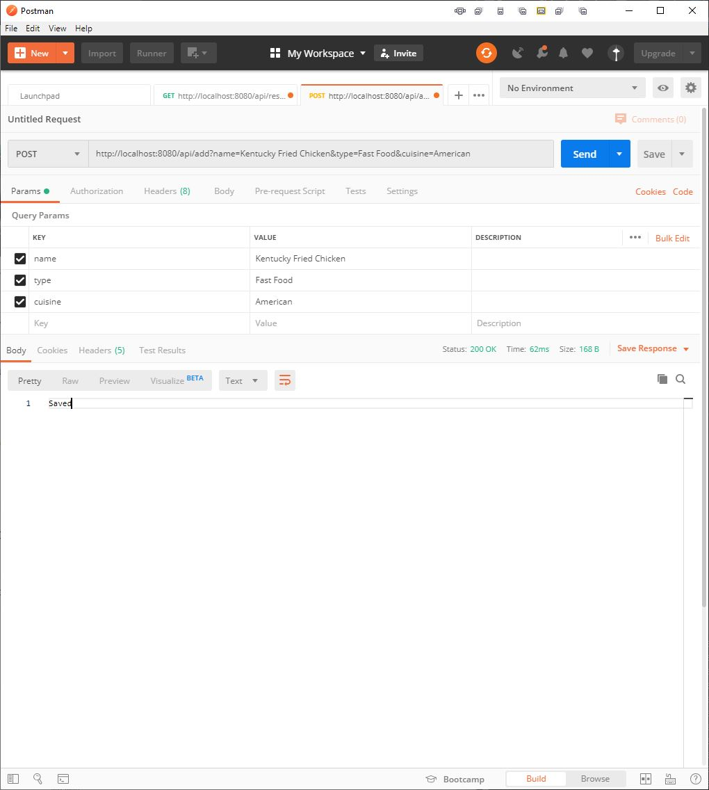

# Restaurant Picker

 
Spring Boot MVC Restful Web Application that connects to a mySQL database and implements
a REST web service that allows the user to create, read, update, and delete Restaurants.

A Spring MVC view displays restaurants from the database using Thymeleaf. 

Spring Boot is used to bootstrap Spring MVC configuration, SQL database connection 
configuration, and integration with the Hibernate framework using the Spring Data JPA.

## Technologies
- Java 8
- Spring 5
- Spring Boot 2.2.4
- Spring Web
- Spring Data JPA
- Spring Boot Devtools
- Thymeleaf
- MySQL
- Maven

##Screenshots
### REST Get

### REST Post 

